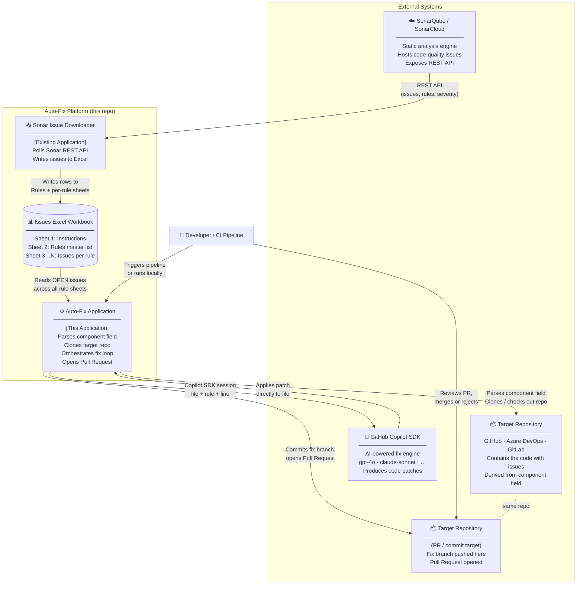
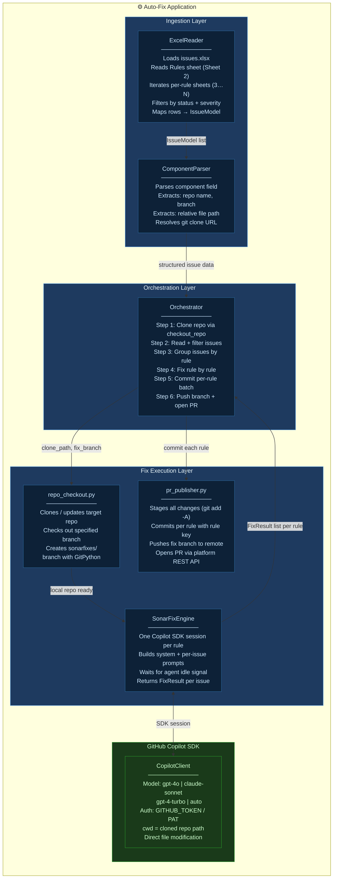
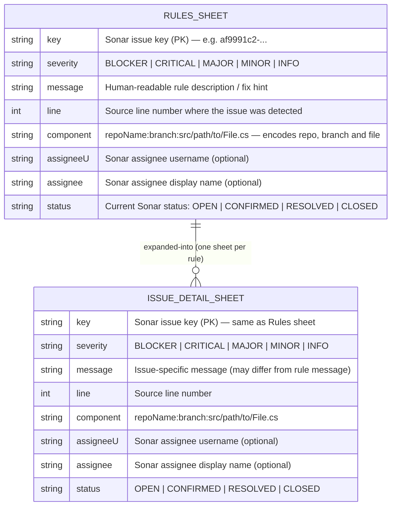
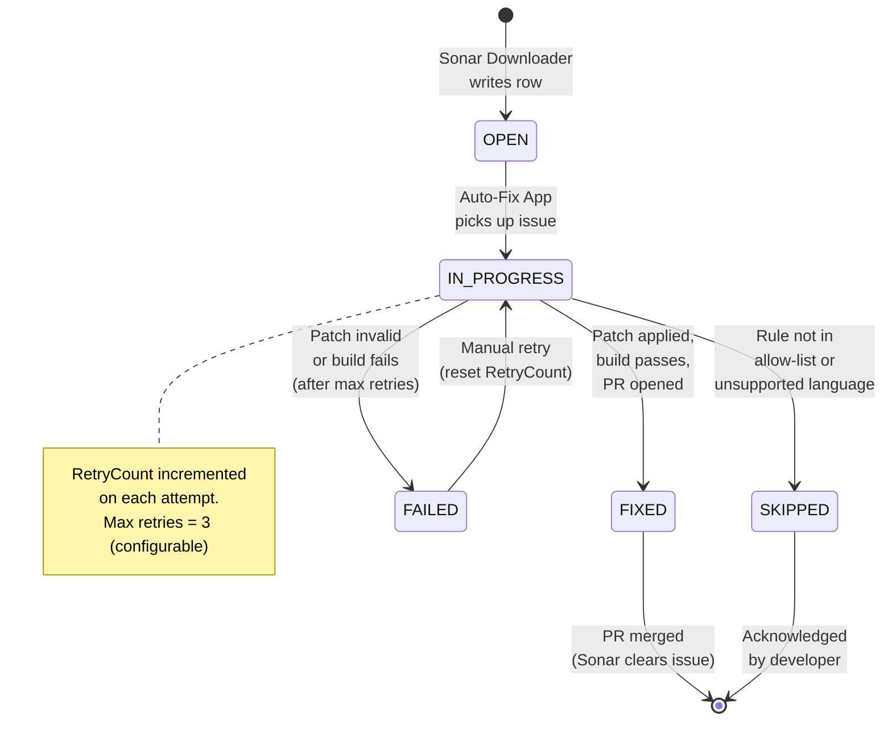
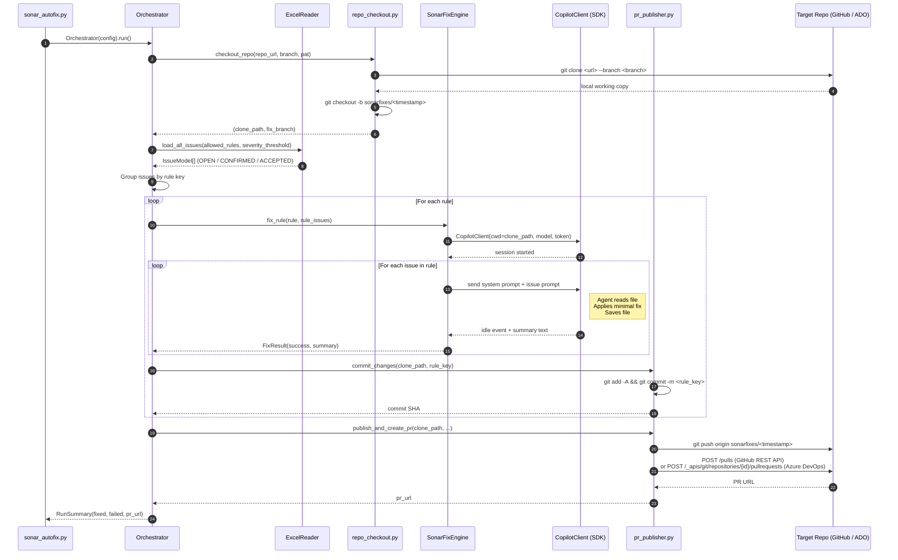
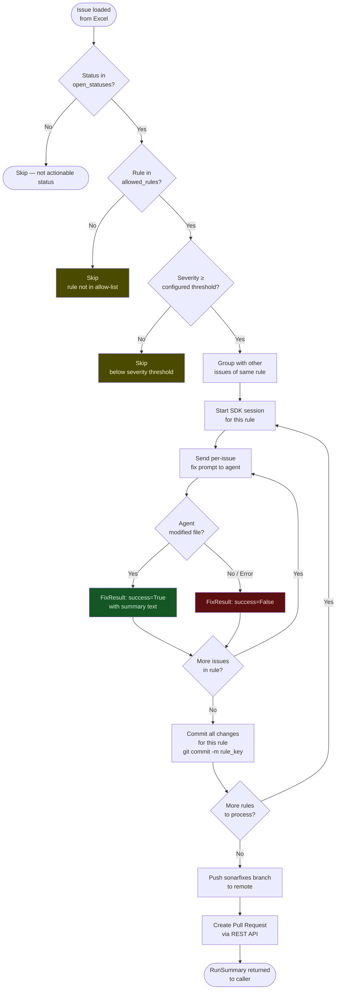
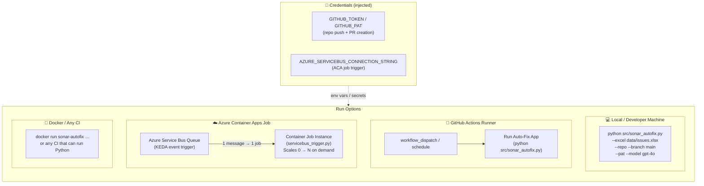
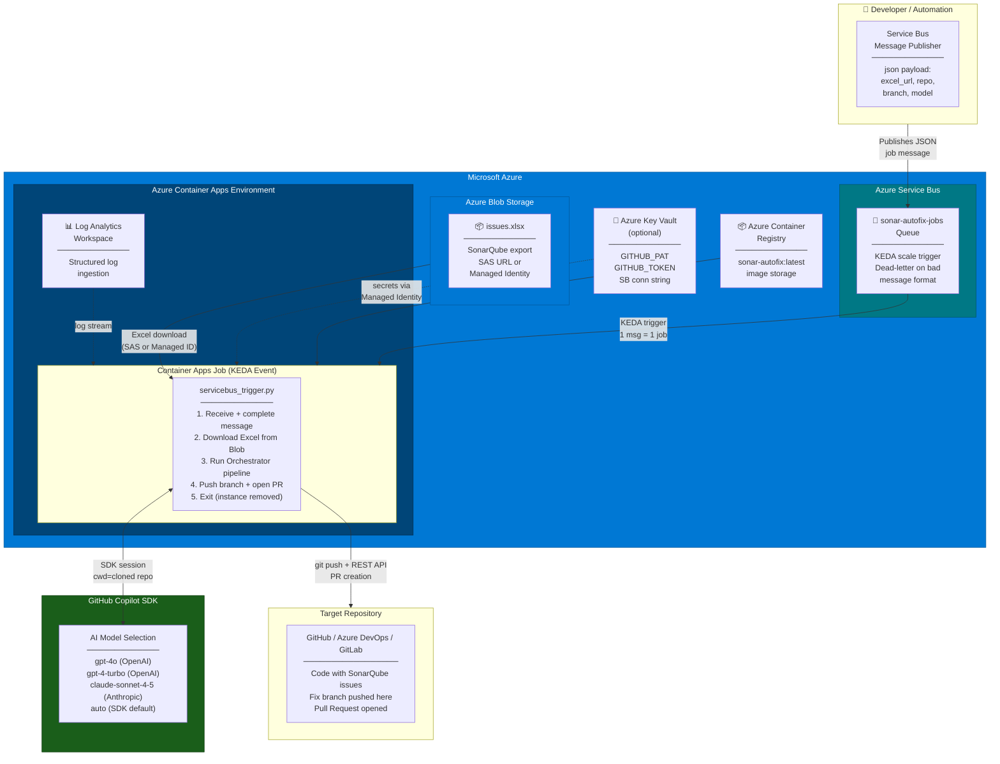
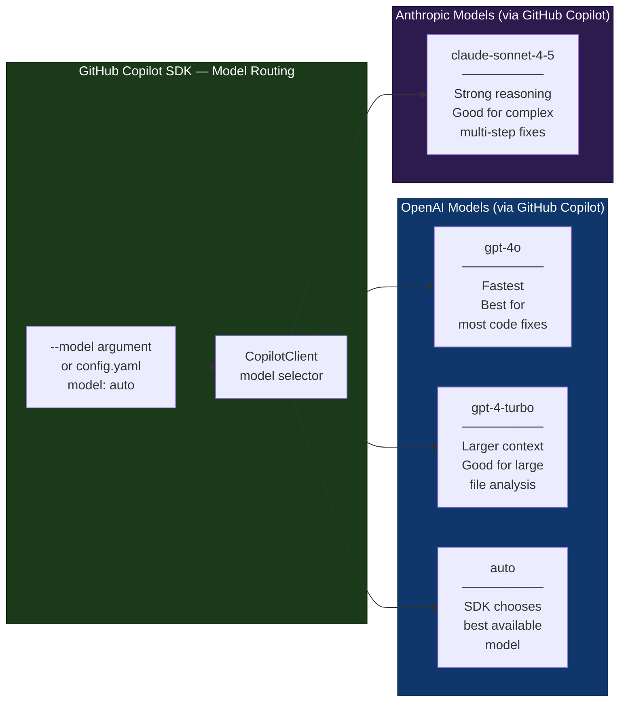

# SDK Challenge — Sonar Auto-Fix Platform

Automated pipeline that ingests SonarQube/SonarCloud code-quality issues via an Excel-based intermediary, **clones the target repository** (GitHub, Azure DevOps, or any HTTPS Git host) identified from each issue's `component` field, and resolves the issues autonomously using the **GitHub Copilot SDK** (supports OpenAI GPT-4o, GPT-4-Turbo, Anthropic Claude, and more).

---

## Table of Contents

0. [Export SonarQube Issues to Excel (Prerequisite Tool)](#0-export-sonarqube-issues-to-excel-prerequisite-tool)
1. [System Context](#1-system-context)
2. [End-to-End Flow](#2-end-to-end-flow)
3. [Component Architecture — Auto-Fix Application](#3-component-architecture--auto-fix-application)
4. [Excel Issue Schema & Issue Lifecycle](#4-excel-issue-schema--issue-lifecycle)
5. [Sequence Diagram — Fix Execution](#5-sequence-diagram--fix-execution)
6. [Decision Flow — Per-Issue Processing](#6-decision-flow--per-issue-processing)
7. [Deployment View](#7-deployment-view)
8. [Azure Deployment Architecture](#8-azure-deployment-architecture)
9. [Run Options — Complete Guide](#9-run-options--complete-guide)
10. [Git Provider Reference](#10-git-provider-reference)
11. [Copilot SDK Model Reference](#11-copilot-sdk-model-reference)
12. [Setup & Usage](#setup--usage)
13. [Configuration Reference](#configuration-file-configsettingsyaml)
14. [Repository Structure](#repository-structure)

---

## 0. Export SonarQube Issues to Excel (Prerequisite Tool)

Before running the Auto-Fix Application you need a populated Excel workbook containing SonarQube issues. The **SonarQube App** (also called *Sonar Issue Downloader*) is a companion tool that connects to SonarQube / SonarCloud via its REST API and writes the results into the Excel format expected by this application.

> **Repository:** [Data and AI IP Library — SonarQube App](https://dev.azure.com/chrysalis-innersource/_git/Data%20and%20AI%20IP%20Library?path=%2FSonar%20Qube%20App&version=GBmain)

### 0.1 What the Tool Does

| Step | Action |
|---|---|
| 1 | Authenticates against your SonarQube / SonarCloud instance using a user token |
| 2 | Fetches all issues for a given project key via the Sonar REST API (`/api/issues/search`) |
| 3 | Retrieves the corresponding rule definitions (`/api/rules/search`) |
| 4 | Writes a multi-sheet Excel workbook: **Sheet 1** Instructions, **Sheet 2** Rules master list, **Sheets 3…N** one sheet per rule containing all individual issues |
| 5 | Outputs a `.xlsx` file ready to be consumed by `src/sonar_autofix.py` |

### 0.2 Configuration

The tool expects the following environment variables (or a local `.env` / config file — see the tool's own README for details):

| Variable | Description |
|---|---|
| `SONAR_URL` | Base URL of your SonarQube instance, e.g. `https://sonarcloud.io` or `https://sonar.mycompany.com` |
| `SONAR_TOKEN` | SonarQube user token with at least **Browse** permission on the project |
| `SONAR_PROJECT_KEY` | The project key shown in SonarQube (e.g. `myorg_myrepo`) |
| `OUTPUT_PATH` | (Optional) Output path for the generated `.xlsx` file — defaults to `issues.xlsx` in the current directory |

### 0.3 Typical Usage

```bash
# 1. Clone the SonarQube App tool
git clone https://dev.azure.com/chrysalis-innersource/Data%20and%20AI%20IP%20Library/_git/Data%20and%20AI%20IP%20Library
cd "Data and AI IP Library/Sonar Qube App"

# 2. Install tool dependencies
pip install -r requirements.txt

# 3. Set required environment variables
export SONAR_URL="https://sonarcloud.io"
export SONAR_TOKEN="squ_xxxxxxxxxxxxxxxxxxxx"
export SONAR_PROJECT_KEY="myorg_myrepo"
export OUTPUT_PATH="./data/issues.xlsx"

# 4. Run the export
python main.py

# Output: data/issues.xlsx  ← pass this to --excel in the next step
```

On Windows (PowerShell):

```powershell
$env:SONAR_URL        = "https://sonarcloud.io"
$env:SONAR_TOKEN      = "squ_xxxxxxxxxxxxxxxxxxxx"
$env:SONAR_PROJECT_KEY = "myorg_myrepo"
$env:OUTPUT_PATH       = ".\data\issues.xlsx"

python main.py
```

### 0.4 Output Workbook Structure

The generated workbook follows the schema consumed by this Auto-Fix Application (described in detail in [§ 4](#4-excel-issue-schema--issue-lifecycle)):

```
issues.xlsx
├── Sheet 1 — Instructions      (human-readable guidance, not parsed)
├── Sheet 2 — Rules             (one row per unique Sonar rule)
├── Sheet 3 — <rule-key-1>      (all issues for that rule)
├── Sheet 4 — <rule-key-2>
└── …
```

Each issue row contains the `component` field in the format `<RepoName>:<Branch>:src/path/to/File.cs`, which the Auto-Fix Application uses to determine which repository to clone and which file to fix.

### 0.5 End-to-End Handoff

```
[SonarQube App]               [This Auto-Fix Application]
      │                                    │
      │  python main.py                    │
      │  ──────────────>  issues.xlsx      │
      │                        │           │
      │                        └──────>  python src/sonar_autofix.py
      │                                   --excel data/issues.xlsx
      │                                   --repo  <url>
      │                                   --branch main
```

Once `issues.xlsx` is generated, pass it to the Auto-Fix pipeline:

```bash
python src/sonar_autofix.py \
  --excel  data/issues.xlsx \
  --repo   https://github.com/org/my-repo.git \
  --branch main \
  --pat    ghp_xxxxxxxxxxxxxxxxxxxx \
  --model  gpt-4o
```

---

## 1. System Context

High-level view of all actors and systems involved.



---

## 2. End-to-End Flow

Macro data flow from Sonar scan to merged fix.

```mermaid
flowchart LR
    A([🔍 Sonar Scan<br/>runs on repo]) -->|Issues detected| B[Sonar Issue<br/>Downloader App]
    B -->|Fetches via<br/>REST API| C[(SonarQube /<br/>SonarCloud)]
    C -->|JSON issue list| B
    B -->|Writes Rules sheet<br/>+ per-rule sheets| D[(Excel Workbook<br/>issues.xlsx)]

    D -->|Read OPEN rows<br/>from all rule sheets| E[Auto-Fix<br/>Application]

    E -->|Parse component field<br/>Extract repo + branch + path| E2[Component<br/>Parser]
    E2 -->|repo URL + branch + file path| F{Issue<br/>actionable?}
    F -- No --> G[Mark SKIPPED]
    F -- Yes --> H[Clone / pull<br/>target Git repo<br/>check out branch<br/>create sonarfixes branch]

    H --> I[Start Copilot SDK<br/>Session per Rule<br/>gpt-4o · claude · auto]
    I -->|Agent applies fix<br/>directly to file| J{File<br/>changed?}

    J -- No --> K[Mark FAILED<br/>in outcomes]
    J -- Yes --> L[Commit per-rule<br/>batch of fixes]
    L --> M[Push fix branch<br/>to remote]
    M --> N[Open Pull Request<br/>via platform REST API<br/>GitHub · Azure DevOps]
    N --> O([👤 Developer<br/>reviews PR])
```



---

## 3. Component Architecture — Auto-Fix Application

Internal modules of the **Auto-Fix Application** as implemented.



---

## 4. Excel Issue Schema & Issue Lifecycle

### 4.1 Excel Workbook Structure

The workbook contains the following sheets:

| Sheet | Name | Purpose |
|---|---|---|
| 1 | **Instructions** | Human-readable guidance on how to use the workbook — not consumed by the application |
| 2 | **Rules** | Master list of Sonar rules exported for this project; one row per unique rule |
| 3…N | **&lt;RuleName&gt;** | One sheet per rule (named after the rule key); contains all individual issues for that rule |



> **`component` field format** — The `component` column encodes the full location of the issue as a colon-separated string:
> ```
> <RepoName>:<Branch>:src/relative/path/to/File.cs
> ```
> For example: `PROJECT_NAME:src/api/WebApi/Program.cs`
> The application parses this field to determine **which git repository to clone**, **which branch to check out**, and **which file to pass to the GHCP SDK CLI**.

### 4.2 Issue Status Lifecycle



---

## 5. Sequence Diagram — Fix Execution

Detailed interaction between modules for a single rule's batch of issues.



---

## 6. Decision Flow — Per-Issue Processing

Logic the orchestrator applies before invoking the fix engine.



---

## 7. Deployment View

How the platform components are deployed across environments.



---

## 8. Azure Deployment Architecture

Full Azure-native deployment using Container Apps Jobs, Service Bus, and Blob Storage.



### 8.1 Azure Bicep Deployment

A complete Bicep template is provided at `deploy/azure-container-apps-job.bicep`.

```bash
# Deploy to Azure
az deployment group create \
  --resource-group rg-sonarfix \
  --template-file deploy/azure-container-apps-job.bicep \
  --parameters \
      containerImage='myregistry.azurecr.io/sonar-autofix:latest' \
      serviceBusConnectionString='Endpoint=sb://...' \
      serviceBusQueueName='sonar-autofix-jobs' \
      githubPat='ghp_xxx' \
      githubToken='ghp_xxx' \
      maxConcurrentJobs=5 \
      logLevel='INFO'
```

The Bicep template creates:
- **Log Analytics Workspace** — structured log ingestion
- **Container Apps Environment** — shared networking and logging layer
- **Container Apps Job** — KEDA event-triggered job (scales 0 → N on demand, zero idle cost)
- **KEDA Service Bus scale rule** — 1 job instance per pending message

### 8.2 Service Bus Message Schema

Publish a JSON message to the queue to trigger a job run:

```json
{
  "excel_url": "https://mystg.blob.core.windows.net/exports/DOTNET.xlsx?<sas>",
  "repo":      "https://github.com/org/repo.git",
  "branch":    "main",
  "model":     "gpt-4o",
  "severity":  "MAJOR",
  "rules":     "cs-S1006,cs-S1110",
  "timeout":   300,
  "log_level": "INFO"
}
```

See `deploy/servicebus_message_schema.json` for the full JSON Schema.

---

## 9. Run Options — Complete Guide

### 9.1 Run Locally (Python CLI)

The simplest way to run the pipeline directly on your machine.

```bash
# Minimal — public repo, all rules, SDK default model
python src/sonar_autofix.py \
  --excel  data/issues.xlsx \
  --repo   https://github.com/org/my-repo.git \
  --branch main

# Private repo with PAT
python src/sonar_autofix.py \
  --excel  data/issues.xlsx \
  --repo   https://github.com/org/private-repo.git \
  --branch develop \
  --pat    ghp_xxxxxxxxxxxxxxxxxxxx

# Specify OpenAI GPT-4o model explicitly
python src/sonar_autofix.py \
  --excel  data/issues.xlsx \
  --repo   https://github.com/org/my-repo.git \
  --branch main \
  --pat    ghp_xxxxxxxxxxxxxxxxxxxx \
  --model  gpt-4o

# Use Anthropic Claude via the Copilot SDK
python src/sonar_autofix.py \
  --excel  data/issues.xlsx \
  --repo   https://github.com/org/my-repo.git \
  --branch main \
  --pat    ghp_xxxxxxxxxxxxxxxxxxxx \
  --model  claude-sonnet-4-5

# Fix only specific rules, minimum MAJOR severity
python src/sonar_autofix.py \
  --excel    data/issues.xlsx \
  --repo     https://github.com/org/my-repo.git \
  --branch   main \
  --pat      ghp_xxxxxxxxxxxxxxxxxxxx \
  --rules    cs-S1006,cs-S1110,cs-S1116 \
  --severity MAJOR

# Azure DevOps repo with username + PAT auth
python src/sonar_autofix.py \
  --excel        data/issues.xlsx \
  --repo         https://dev.azure.com/myorg/MyProject/_git/MyRepo \
  --branch       main \
  --pat          <azure-devops-pat> \
  --git-username myazureusername \
  --model        gpt-4o

# Full options with custom PR title, 10-minute timeout per issue
python src/sonar_autofix.py \
  --excel         data/issues.xlsx \
  --repo          https://github.com/org/my-repo.git \
  --branch        main \
  --pat           ghp_xxxxxxxxxxxxxxxxxxxx \
  --github-token  ghp_xxxxxxxxxxxxxxxxxxxx \
  --model         gpt-4o \
  --rules         cs-S1006,cs-S1110 \
  --severity      MINOR \
  --timeout       600 \
  --workdir       ./workdir \
  --pr-title      "fix(sonar): automated fixes for Sprint 42" \
  --log-level     DEBUG
```

### 9.2 Run with Docker

Build and run the container image locally.

```bash
# Build the image
docker build -t sonar-autofix:latest .

# Run against a GitHub repo
docker run --rm \
  -e GITHUB_PAT=ghp_xxxxxxxxxxxxxxxxxxxx \
  -e GITHUB_TOKEN=ghp_xxxxxxxxxxxxxxxxxxxx \
  -v $(pwd)/data:/app/data:ro \
  sonar-autofix:latest \
  python src/sonar_autofix.py \
    --excel  /app/data/issues.xlsx \
    --repo   https://github.com/org/my-repo.git \
    --branch main \
    --pat    "$GITHUB_PAT" \
    --model  gpt-4o

# Run against Azure DevOps
docker run --rm \
  -e GITHUB_TOKEN=ghp_xxxxxxxxxxxxxxxxxxxx \
  -v $(pwd)/data:/app/data:ro \
  sonar-autofix:latest \
  python src/sonar_autofix.py \
    --excel        /app/data/issues.xlsx \
    --repo         https://dev.azure.com/org/Project/_git/Repo \
    --branch       main \
    --pat          "<ado-pat>" \
    --git-username "<ado-username>" \
    --model        gpt-4o
```

### 9.3 Run with GitHub Actions

Add the following workflow to your repository (`.github/workflows/sonar-autofix.yml`):

```yaml
name: Sonar Auto-Fix

on:
  workflow_dispatch:
    inputs:
      excel_path:
        description: 'Path to the SonarQube Excel export in the repo'
        required: true
        default: 'data/issues.xlsx'
      branch:
        description: 'Target branch to fix and open PR against'
        required: true
        default: 'main'
      model:
        description: 'Copilot model (gpt-4o, claude-sonnet-4-5, auto)'
        required: false
        default: 'gpt-4o'
      severity:
        description: 'Minimum severity (INFO|MINOR|MAJOR|CRITICAL|BLOCKER)'
        required: false
        default: 'MINOR'
  schedule:
    - cron: '0 3 * * 1'   # Every Monday at 03:00 UTC

jobs:
  sonar-autofix:
    runs-on: ubuntu-latest
    permissions:
      contents: write
      pull-requests: write

    steps:
      - name: Checkout platform repo
        uses: actions/checkout@v4

      - name: Set up Python 3.11
        uses: actions/setup-python@v5
        with:
          python-version: '3.11'

      - name: Install dependencies
        run: pip install -r requirements.txt

      - name: Authenticate GitHub Copilot CLI
        run: echo "${{ secrets.GITHUB_TOKEN }}" | gh auth login --with-token

      - name: Run Sonar Auto-Fix pipeline
        env:
          GITHUB_TOKEN: ${{ secrets.GITHUB_TOKEN }}
        run: |
          python src/sonar_autofix.py \
            --excel    "${{ inputs.excel_path }}" \
            --repo     https://github.com/${{ github.repository }}.git \
            --branch   "${{ inputs.branch }}" \
            --pat      "${{ secrets.GITHUB_TOKEN }}" \
            --model    "${{ inputs.model }}" \
            --severity "${{ inputs.severity }}" \
            --log-level INFO
```

> **Tip:** Store your PAT or GitHub Copilot token as a repository secret (`Settings → Secrets and variables → Actions`).

### 9.4 Run as Azure Container Apps Job

**Architecture:**  Azure Service Bus queue → KEDA trigger → Container Apps Job (zero idle cost, scales 0 → N).

```bash
# 1. Deploy the infrastructure
az deployment group create \
  --resource-group rg-sonarfix \
  --template-file deploy/azure-container-apps-job.bicep \
  --parameters \
      containerImage='myregistry.azurecr.io/sonar-autofix:latest' \
      serviceBusConnectionString="$SB_CONN_STRING" \
      serviceBusQueueName='sonar-autofix-jobs' \
      githubPat="$GITHUB_PAT" \
      maxConcurrentJobs=5

# 2. Send a job message to trigger a run
az servicebus message send \
  --connection-string "$SB_CONN_STRING" \
  --queue-name sonar-autofix-jobs \
  --body '{
    "excel_url": "https://myaccount.blob.core.windows.net/exports/issues.xlsx?sv=...",
    "repo":      "https://github.com/org/repo.git",
    "branch":    "main",
    "model":     "gpt-4o",
    "severity":  "MAJOR"
  }'

# 3. Monitor job execution
az containerapp job execution list \
  --resource-group rg-sonarfix \
  --name sonarfix-job \
  --output table
```

The container entry-point for the job is `src/servicebus_trigger.py`, which:
1. Receives and completes one message from the queue
2. Downloads the Excel workbook from the `excel_url` (supports SAS URL and Managed Identity)
3. Runs the full `Orchestrator` pipeline
4. Exits — the Container Apps Job runtime removes the instance

### 9.5 Run Individual Pipeline Steps

These lower-level scripts can be used stand-alone for testing or debugging.

#### Step 1 — Clone a repository (`src/repo_checkout.py`)

```bash
# GitHub
python src/repo_checkout.py \
  --repo    https://github.com/org/my-repo.git \
  --branch  main \
  --pat     ghp_xxxxxxxxxxxxxxxxxxxx \
  --workdir ./workdir

# Azure DevOps
python src/repo_checkout.py \
  --repo    https://dev.azure.com/org/Project/_git/Repo \
  --branch  main \
  --pat     <ado-pat> \
  --workdir ./workdir
```

Clones into `workdir/<repo-name>/`, checks out `<branch>`, and creates a `sonarfixes/<timestamp>` working branch.  If the directory already contains a valid Git clone it is fetched and updated rather than re-cloned.

#### Step 2 — Publish fixes and open a PR (`src/pr_publisher.py`)

```bash
# GitHub
python src/pr_publisher.py \
  --clone-dir     ./workdir/my-repo \
  --repo-url      https://github.com/org/my-repo.git \
  --fix-branch    sonarfixes/20260305_120000 \
  --base-branch   main \
  --commit-message "fix: apply sonarqube auto-fixes" \
  --pat           ghp_xxxxxxxxxxxxxxxxxxxx \
  --pr-title      "Sonar auto-fixes" \
  --pr-body       "Automated fixes applied."

# Azure DevOps
python src/pr_publisher.py \
  --clone-dir     ./workdir/MyRepo \
  --repo-url      https://dev.azure.com/org/Project/_git/MyRepo \
  --fix-branch    sonarfixes/20260305_120000 \
  --base-branch   main \
  --commit-message "fix: apply sonarqube auto-fixes" \
  --pat           <ado-pat>
```

Stages all changes, commits, pushes the fix branch, and opens a Pull Request. Platform is auto-detected from the URL (`github.com` → GitHub REST API; `dev.azure.com` / `visualstudio.com` → Azure DevOps REST API).

---

## 10. Git Provider Reference

The platform uses standard HTTPS Git operations and REST APIs, making it compatible with any HTTPS-accessible Git host.

### 10.1 GitHub

| Setting | Value |
|---|---|
| Repo URL format | `https://github.com/<owner>/<repo>.git` |
| Clone auth | PAT injected as `https://<pat>@github.com/...` |
| `--git-username` | Omit (or use `x-access-token`) |
| PR REST API | `POST https://api.github.com/repos/{owner}/{repo}/pulls` |
| Required PAT scopes | `repo` (full), or `contents:write` + `pull_requests:write` (fine-grained) |
| `--pat` | GitHub PAT (`ghp_…`) |

```bash
python src/sonar_autofix.py \
  --repo   https://github.com/myorg/myrepo.git \
  --branch main \
  --pat    ghp_xxxxxxxxxxxxxxxxxxxx \
  --model  gpt-4o
```

### 10.2 Azure DevOps

| Setting | Value |
|---|---|
| Repo URL format | `https://dev.azure.com/<org>/<project>/_git/<repo>` |
| Clone auth | PAT injected as `https://<username>:<pat>@dev.azure.com/...` |
| `--git-username` | Your Azure AD username (required for ADO) |
| PR REST API | `POST https://dev.azure.com/{org}/{project}/_apis/git/repositories/{repo}/pullrequests` |
| Required PAT scopes | `Code: Read & Write` |
| `--pat` | Azure DevOps PAT (generate at `dev.azure.com → User Settings → Personal Access Tokens`) |

```bash
python src/sonar_autofix.py \
  --repo         https://dev.azure.com/myorg/MyProject/_git/MyRepo \
  --branch       main \
  --pat          <ado-pat> \
  --git-username myazureusername \
  --model        gpt-4o
```

> **Note:** Azure DevOps also accepts the legacy `https://<org>.visualstudio.com/<project>/_git/<repo>` format — the platform auto-detects both.

### 10.3 GitLab / Other Providers

The **clone and push** steps work with any HTTPS Git host.  Pull Request creation is not natively supported for GitLab/Gitea/Bitbucket, but the branch will still be pushed and you can create the PR manually.

```bash
# Clone + push works for any HTTPS host
python src/sonar_autofix.py \
  --repo   https://gitlab.com/mygroup/myrepo.git \
  --branch main \
  --pat    <gitlab-pat> \
  --model  gpt-4o
# The fix branch is pushed; create an MR manually in the GitLab UI
```

To add native PR/MR creation for another provider, implement a new branch in `src/pr_publisher.py` — the `detect_platform()` function returns `"unknown"` for unsupported hosts and the branch push still succeeds.

### 10.4 SSH Remotes

SSH remotes are supported for cloning (no PAT required) but PAT injection for push is only available with HTTPS.  For SSH-authenticated pipelines, configure SSH agent forwarding in your CI environment:

```bash
# SSH clone — no --pat required for clone
# (push auth relies on the active SSH agent)
python src/sonar_autofix.py \
  --repo   git@github.com:myorg/myrepo.git \
  --branch main \
  --model  gpt-4o
```

---

## 11. Copilot SDK Model Reference

The `--model` argument is passed directly to the GitHub Copilot SDK `CopilotClient`.  Any model available in your Copilot subscription can be specified.  Pass `auto` (or omit `--model`) to use the model configured in the Copilot CLI.



| Model | Provider | Best for | Notes |
|---|---|---|---|
| `auto` | SDK default | General use | SDK picks the best available model |
| `gpt-4o` | OpenAI | Fast, accurate code fixes | Recommended for most workloads |
| `gpt-4-turbo` | OpenAI | Large files, wide context | Higher latency, larger context window |
| `claude-sonnet-4-5` | Anthropic | Complex multi-step reasoning | Strong at understanding intent |

> Models are subject to the availability and entitlements of your GitHub Copilot subscription.

---

---

## Glossary

| Term | Description |
|---|---|
| **GHCP SDK CLI** | GitHub Copilot SDK command-line interface used to generate code fixes |
| **Sonar Issue Downloader** | Existing application that polls the Sonar REST API and writes issues to the Excel workbook |
| **Auto-Fix Application** | New application in this repository; reads Excel, clones target repos, drives the fix loop |
| **Target Repository** | The GitHub repository that contains the buggy code; identified by parsing the `component` field in the Excel issue row |
| **component field** | Excel column encoding the target repo, branch, and file path as `<RepoName>:<Branch>:src/path/File.cs` |
| **ComponentParser** | Module that splits the `component` field into a git clone URL, branch name, and relative file path |
| **IssueModel** | Internal data transfer object representing one row from a per-rule Excel sheet |
| **Rules Sheet** | Sheet 2 of the workbook; master list of Sonar rules, one row per unique rule key |
| **Per-Rule Sheet** | Sheets 3…N, each named after a rule key; contains all individual issue rows for that rule |
| **Patch** | A unified diff output produced by the GHCP SDK CLI representing the proposed fix |
| **Fix Branch** | A short-lived Git branch created per issue in the target repo, named e.g. `autofix/af9991c2` |
| **Allow-list** | Configurable set of Sonar rule keys that the Auto-Fix Application is permitted to attempt |

---

## Setup & Usage

### Prerequisites

- **Python 3.11+**
- **GitHub Copilot CLI** — installed and authenticated
- A GitHub account with a Copilot subscription (for SDK model access)
- A GitHub PAT (or Azure DevOps PAT) for pushing branches and creating PRs

```bash
# 1. Install Python dependencies
pip install -r requirements.txt

# 2. Ensure the Copilot CLI is on your PATH and authenticated
#    See: https://docs.github.com/en/copilot/how-tos/set-up/install-copilot-cli
copilot auth login
```

---

### Running the Auto-Fix Pipeline (`src/sonar_autofix.py`)

This is the **main entry-point**. It reads the Excel workbook, clones the target repository, invokes the GitHub Copilot SDK (with your chosen model) to fix each issue rule-by-rule, commits the fixes, and opens a Pull Request.

```
usage: sonar_autofix.py [-h]
       --excel PATH --repo URL --branch BRANCH
       [--pat TOKEN] [--github-token TOKEN] [--git-username USERNAME]
       [--model MODEL] [--timeout SECONDS]
       [--rules KEY,KEY,...] [--severity LEVEL]
       [--workdir PATH] [--pr-title TITLE] [--pr-body BODY]
       [--log-level LEVEL]
```

#### Argument reference

| Argument | Required | Description |
|---|---|---|
| `--excel PATH` | ✅ | Path to the `.xlsx` SonarQube issue export |
| `--repo URL` | ✅ | HTTPS clone URL of the target repository (GitHub, Azure DevOps, etc.) |
| `--branch BRANCH` | ✅ | Branch to check out and target as the PR base |
| `--pat TOKEN` | — | PAT for cloning private repos, pushing the fix branch, and creating the PR |
| `--github-token TOKEN` | — | Separate GitHub OAuth token for the Copilot SDK (falls back to `--pat`) |
| `--git-username USERNAME` | — | Git username paired with `--pat` (required for Azure DevOps HTTPS auth) |
| `--model MODEL` | — | Copilot model: `gpt-4o`, `gpt-4-turbo`, `claude-sonnet-4-5`, or `auto` |
| `--timeout SECONDS` | — | Per-issue agent timeout in seconds (default: `300`) |
| `--rules KEY,...` | — | Comma-separated rule keys to process. Omit to fix all rules |
| `--severity LEVEL` | — | Minimum severity: `INFO` \| `MINOR` \| `MAJOR` \| `CRITICAL` \| `BLOCKER` |
| `--workdir PATH` | — | Root directory for cloned repos (default: `./workdir`) |
| `--pr-title TITLE` | — | Custom PR title (auto-generated when omitted) |
| `--pr-body BODY` | — | Custom PR body in Markdown (auto-generated when omitted) |
| `--log-level LEVEL` | — | Python log level: `DEBUG` \| `INFO` \| `WARNING` \| `ERROR` (default: `INFO`) |

#### Exit codes

| Code | Meaning |
|---|---|
| `0` | All issues fixed successfully (or no actionable issues found) |
| `1` | Pipeline completed but at least one issue could not be fixed |
| `2` | Fatal error (bad arguments, clone failure, Copilot SDK not installed, etc.) |

---

### Configuration file (`config/settings.yaml`)

Default values for model, severity threshold, timeouts, and PR labels.  CLI arguments always take precedence over the config file.

```yaml
copilot:
  model: auto                   # or: gpt-4o, gpt-4-turbo, claude-sonnet-4-5
  issue_timeout_seconds: 300

filtering:
  severity_threshold: MINOR
  allowed_rules: []             # empty = all rules
  open_statuses: [OPEN, CONFIRMED, ACCEPTED]

git:
  workdir: ./workdir
  shallow_clone: true

pull_request:
  title: ""                     # empty = auto-generate
  body: ""
  labels: [sonar-autofix, automated]

logging:
  level: INFO
```

---

### Running the tests

```bash
pytest

# Run specific test modules
pytest tests/test_excel_reader.py -v
pytest tests/test_component_parser.py -v
pytest tests/test_sonar_fix_engine.py -v
pytest tests/test_repo_checkout.py -v
pytest tests/test_pr_publisher.py -v
```

All tests pass with no external services required (the GitHub Copilot SDK is mocked in the test suite).

---

## Glossary

| Term | Description |
|---|---|
| **GitHub Copilot SDK** | Python SDK that wraps the Copilot agent — supports OpenAI and Anthropic models |
| **CopilotClient** | SDK class instantiated with `cwd=<repo_path>` so the agent can read and modify files |
| **Export Sonar Issue** | Existing application that polls the Sonar REST API and writes issues to Excel [repo](https://dev.azure.com/chrysalis-innersource/_git/Data%20and%20AI%20IP%20Library?path=%2FSonar%20Qube%20App&version=GBmain) |
| **Auto-Fix Application** | This repository; reads Excel, clones repos, drives the fix → commit → PR loop |
| **Target Repository** | The repository containing buggy code; identified from the `component` field |
| **component field** | Excel column encoding the target repo, branch, and file path as `<RepoName>:<Branch>:src/path/File.cs` |
| **ComponentParser** | Module that splits the `component` field into a git clone URL, branch name, and file path |
| **IssueModel** | Internal data transfer object representing one row from a per-rule Excel sheet |
| **Rules Sheet** | Sheet 2 of the workbook; master list of Sonar rules, one row per unique rule key |
| **Per-Rule Sheet** | Sheets 3…N, each named after a rule key; contains all issue rows for that rule |
| **SonarFixEngine** | Module that opens one Copilot SDK session per rule and sends per-issue fix prompts |
| **Fix Branch** | `sonarfixes/<YYYYMMDD_HHMMSS>` branch created per pipeline run in the target repo |
| **OrchestratorConfig** | Dataclass holding all pipeline settings (passed from CLI args or Service Bus message) |
| **RunSummary** | Result object returned after a pipeline run: `fixed`, `failed`, `pr_url`, `outcomes list` |

---

## Repository Structure

```
github-copilot-sdk-cli-challenge/
├── README.md                        ← this file
├── requirements.txt                 ← Python dependencies
├── pytest.ini                       ← test configuration
├── Dockerfile                       ← container image definition
├── config/
│   └── settings.yaml                ← default settings (model, severity, etc.)
├── deploy/
│   ├── azure-container-apps-job.bicep ← Azure Container Apps Job Bicep template
│   └── servicebus_message_schema.json ← JSON Schema for Service Bus messages
├── src/
│   ├── sonar_autofix.py             ← ★ MAIN CLI entry-point
│   ├── repo_checkout.py             ← Clone/update target repo + create fix branch
│   ├── pr_publisher.py              ← Commit, push, open PR (GitHub + Azure DevOps)
│   ├── servicebus_trigger.py        ← Azure Container Apps Job entry-point
│   ├── ingestion/
│   │   ├── excel_reader.py          ← Reads Rules sheet + per-rule sheets → IssueModel[]
│   │   └── component_parser.py      ← Parses component field → repo URL + file path
│   ├── execution/
│   │   └── sonar_fix_engine.py      ← GitHub Copilot SDK integration (one session/rule)
│   └── orchestration/
│       └── orchestrator.py          ← End-to-end pipeline coordinator
├── tests/
│   ├── test_repo_checkout.py
│   ├── test_pr_publisher.py
│   ├── test_excel_reader.py
│   ├── test_component_parser.py
│   ├── test_servicebus_trigger.py
│   └── test_sonar_fix_engine.py
└── workdir/                         ← cloned repos land here — GITIGNORED
```
