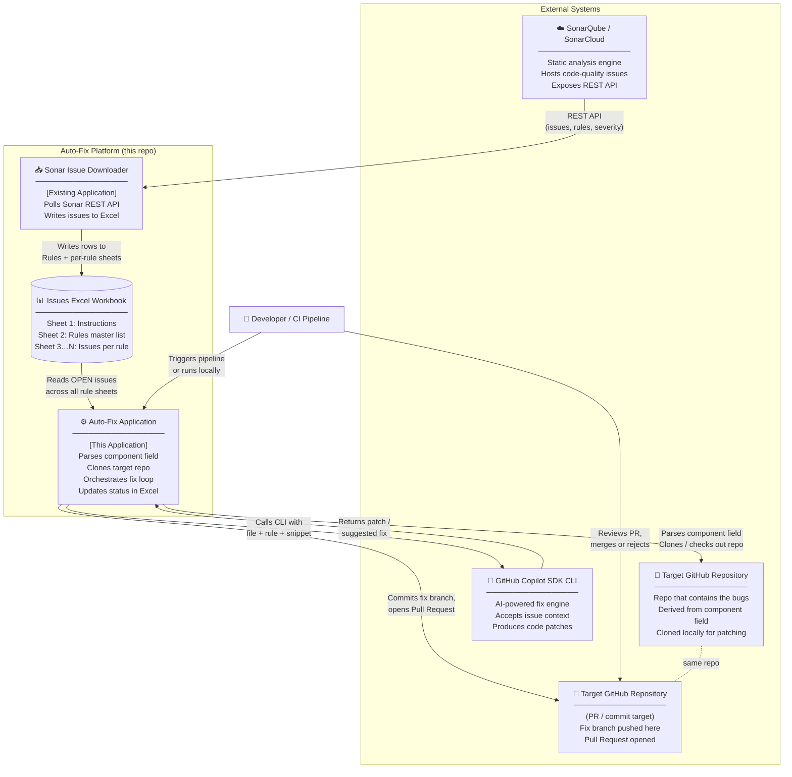
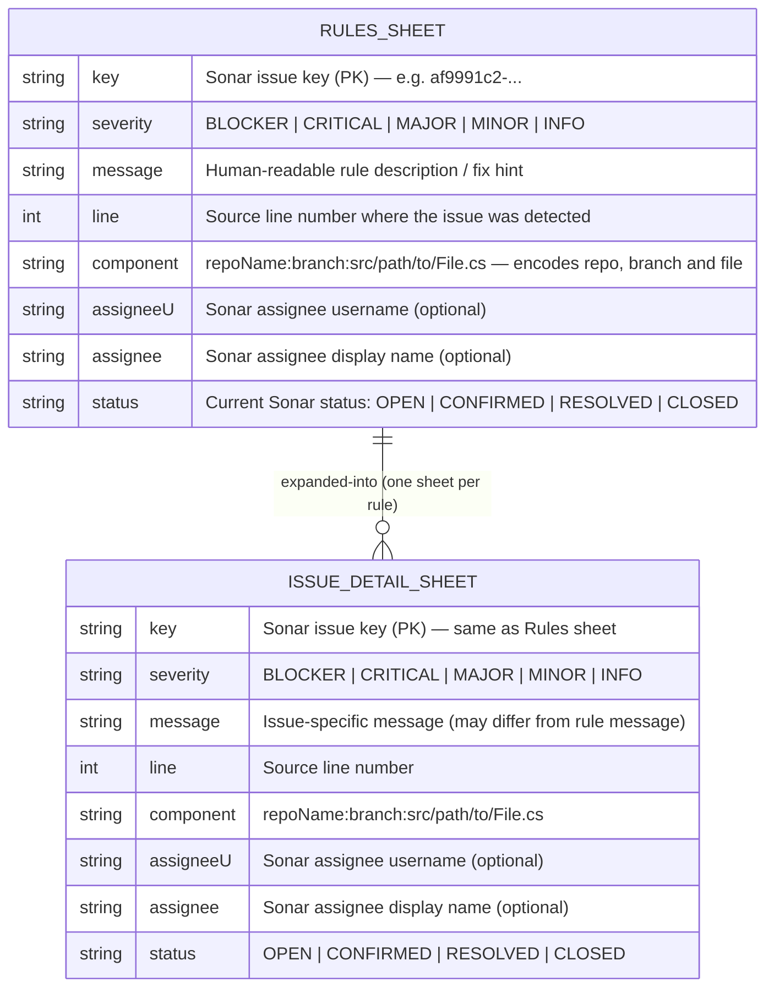
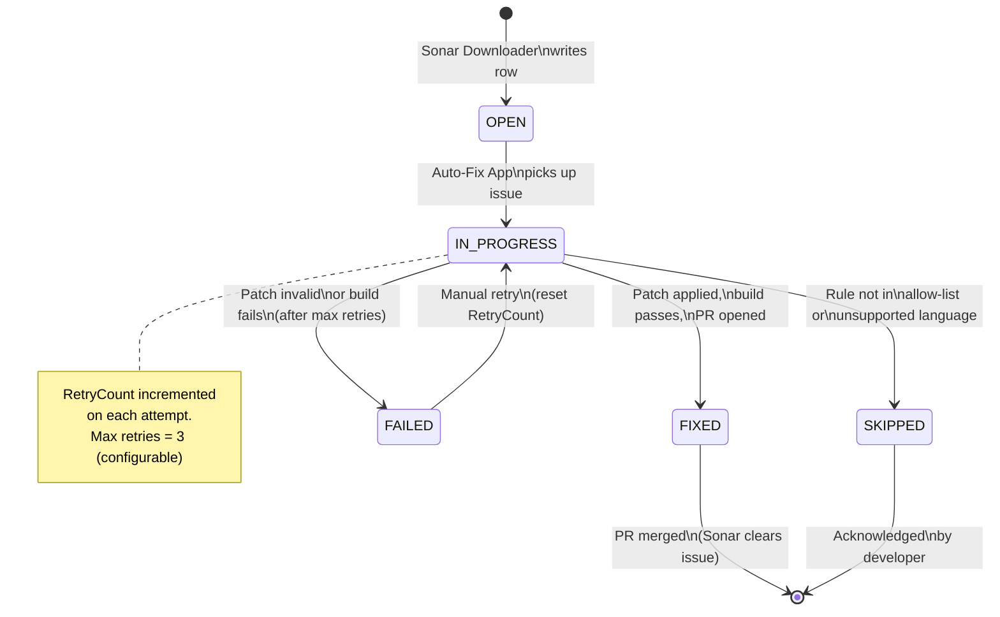
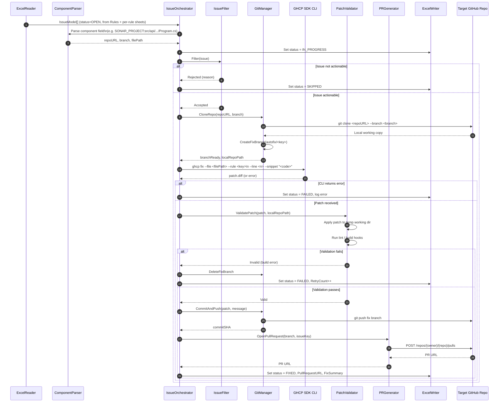
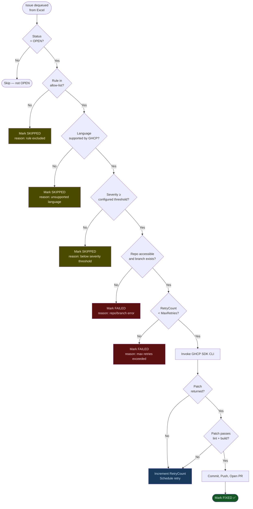
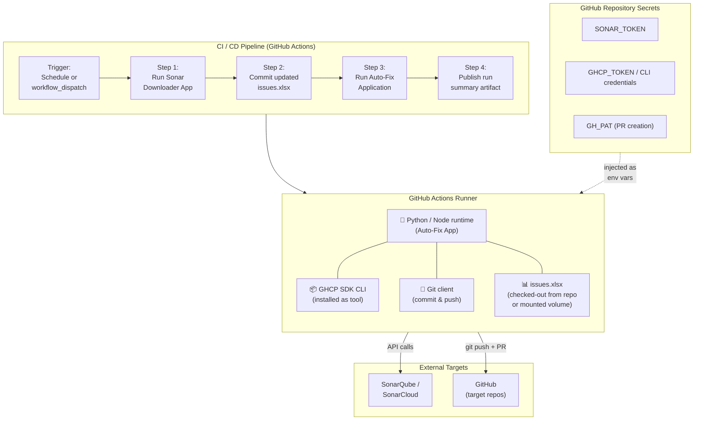

# SDK Challenge — Sonar Auto-Fix Platform

Automated pipeline that ingests SonarQube/SonarCloud code-quality issues via an Excel-based intermediary, **clones the target GitHub repository** identified from each issue's `component` field, and resolves the issues autonomously using the **GitHub Copilot (GHCP) SDK CLI**.

---

## Table of Contents

1. [System Context](#1-system-context)
2. [End-to-End Flow](#2-end-to-end-flow)
3. [Component Architecture — Auto-Fix Application](#3-component-architecture--auto-fix-application)
4. [Excel Issue Schema & Issue Lifecycle](#4-excel-issue-schema--issue-lifecycle)
5. [Sequence Diagram — Fix Execution](#5-sequence-diagram--fix-execution)
6. [Decision Flow — Per-Issue Processing](#6-decision-flow--per-issue-processing)
7. [Deployment View](#7-deployment-view)

---

## 1. System Context

High-level view of all actors and systems involved.



---

## 2. End-to-End Flow

Macro data flow from Sonar scan to merged fix.

```mermaid
flowchart LR
    A([🔍 Sonar Scan\nruns on repo]) -->|Issues detected| B[Sonar Issue\nDownloader App]
    B -->|Fetches via\nREST API| C[(SonarQube /\nSonarCloud)]
    C -->|JSON issue list| B
    B -->|Writes Rules sheet\n+ per-rule sheets| D[(Excel Workbook\nissues.xlsx)]

    D -->|Read OPEN rows\nfrom all rule sheets| E[Auto-Fix\nApplication]

    E -->|Parse component field\nExtract repo + branch + path| E2[Component\nParser]
    E2 -->|repo URL + branch + file path| F{Issue\nactionable?}
    F -- No --> G[Mark SKIPPED\nin Excel]
    F -- Yes --> H[Clone / pull\ntarget Git repo\ncheck out branch]

    H --> I[Invoke\nGHCP SDK CLI\nwith file + rule + snippet]
    I -->|Patch output| J{Patch\nvalid?}

    J -- No --> K[Mark FAILED\nin Excel]
    J -- Yes --> L[Apply patch\nto source file]
    L --> M[Run local\nlint / build check]

    M -->|Fails| K
    M -->|Passes| N[Commit & Push\nfix branch to\ntarget repo]
    N --> O[Open Pull Request\non target repo]
    O --> P[Mark FIXED /\nPR_RAISED in Excel]

    P --> Q([👤 Developer\nreviews PR])
```



---

## 3. Component Architecture — Auto-Fix Application

Internal modules of the **Auto-Fix Application**.

```mermaid
graph TB
    subgraph APP["⚙️ Auto-Fix Application"]
        direction TB

        subgraph Ingestion["Ingestion Layer"]
            EXR["ExcelReader\n────────────\nLoads issues.xlsx\nReads Rules sheet (Sheet 2)\nIterates per-rule sheets (3…N)\nFilters rows where status = OPEN\nMaps rows → IssueModel"]
            CMP["ComponentParser\n────────────\nParses component field\nExtracts: repo name, branch\nExtracts: relative file path\nResolves git clone URL"]
        end

        subgraph Orchestration["Orchestration Layer"]
            ORC["IssueOrchestrator\n────────────\nIterates issue queue\nApplies priority order\nHandles retries & back-off"]
            FILT["IssueFilter\n────────────\nRule allow-list check\nSeverity threshold\nLanguage support check"]
        end

        subgraph Execution["Fix Execution Layer"]
            GIT["GitManager\n────────────\nClones target repo (from component)\nChecks out specified branch\nCreates fix branch\nCommits & pushes patch"]
            CLI["GHCPCLIAdapter\n────────────\nBuilds CLI command\nPasses file + rule + snippet\nParses patch response"]
            VAL["PatchValidator\n────────────\nApplies patch to temp copy\nRuns lint / build hooks\nGo / no-go decision"]
        end

        subgraph Output["Output Layer"]
            PRG["PRGenerator\n────────────\nCreates GitHub PR on target repo\nAttaches Sonar issue ref\nAdds review labels"]
            EXW["ExcelWriter\n────────────\nUpdates status in rule sheet row\nWrites PR URL, timestamp\nRecords fix summary"]
            LOG["Logger / Reporter\n────────────\nStructured JSON logs\nSummary report per run"]
        end
    end

    EXR -->|IssueModel&#91;&#93;| CMP
    CMP -->|repo URL + branch + filePath| ORC
    ORC --> FILT
    FILT -->|Filtered issues| GIT
    GIT -->|Repo path + branch| CLI
    CLI -->|Raw patch| VAL
    VAL -->|Validated patch| GIT
    GIT -->|Committed branch| PRG
    PRG -->|PR URL| EXW
    VAL -->|Failure reason| EXW
    EXW --> LOG

    classDef layer fill:#1e3a5f,color:#e8f4f8,stroke:#4a90d9
    classDef module fill:#0d2137,color:#cce7ff,stroke:#2a6496
    class Ingestion,Orchestration,Execution,Output layer
    class EXR,CMP,ORC,FILT,GIT,CLI,VAL,PRG,EXW,LOG module
```



---

## 4. Excel Issue Schema & Issue Lifecycle

### 4.1 Excel Workbook Structure

The workbook contains the following sheets:

| Sheet | Name | Purpose |
|---|---|---|
| 1 | **Instructions** | Human-readable guidance on how to use the workbook — not consumed by the application |
| 2 | **Rules** | Master list of Sonar rules exported for this project; one row per unique rule |
| 3…N | **&lt;RuleName&gt;** | One sheet per rule (named after the rule key); contains all individual issues for that rule |



> **`component` field format** — The `component` column encodes the full location of the issue as a colon-separated string:
> ```
> <RepoName>:<Branch>:src/relative/path/to/File.cs
> ```
> For example: `EMRSN-MSOL-MAS-API_main:src/api/Mas.Api.WebApi/Program.cs`
> The application parses this field to determine **which git repository to clone**, **which branch to check out**, and **which file to pass to the GHCP SDK CLI**.

### 4.2 Issue Status Lifecycle



---

## 5. Sequence Diagram — Fix Execution

Detailed interaction between modules for a single issue.



---

## 6. Decision Flow — Per-Issue Processing

Logic the orchestrator applies before invoking the fix engine.



---

## 7. Deployment View

How the platform components are deployed across environments.



---

## Glossary

| Term | Description |
|---|---|
| **GHCP SDK CLI** | GitHub Copilot SDK command-line interface used to generate code fixes |
| **Sonar Issue Downloader** | Existing application that polls the Sonar REST API and writes issues to the Excel workbook |
| **Auto-Fix Application** | New application in this repository; reads Excel, clones target repos, drives the fix loop |
| **Target Repository** | The GitHub repository that contains the buggy code; identified by parsing the `component` field in the Excel issue row |
| **component field** | Excel column encoding the target repo, branch, and file path as `<RepoName>:<Branch>:src/path/File.cs` |
| **ComponentParser** | Module that splits the `component` field into a git clone URL, branch name, and relative file path |
| **IssueModel** | Internal data transfer object representing one row from a per-rule Excel sheet |
| **Rules Sheet** | Sheet 2 of the workbook; master list of Sonar rules, one row per unique rule key |
| **Per-Rule Sheet** | Sheets 3…N, each named after a rule key; contains all individual issue rows for that rule |
| **Patch** | A unified diff output produced by the GHCP SDK CLI representing the proposed fix |
| **Fix Branch** | A short-lived Git branch created per issue in the target repo, named e.g. `autofix/af9991c2` |
| **Allow-list** | Configurable set of Sonar rule keys that the Auto-Fix Application is permitted to attempt |

---

## Setup & Usage

### Prerequisites

**Python 3.11+** and the **GitHub Copilot CLI** must both be installed and
authenticated before running the platform.

```bash
# 1. Install Python dependencies
pip install -r requirements.txt

# 2. Ensure the Copilot CLI is on your PATH and authenticated
#    See: https://docs.github.com/en/copilot/how-tos/set-up/install-copilot-cli
copilot auth login
```

---

### Running the Auto-Fix Pipeline (`src/sonar_autofix.py`)

This is the **main entry-point**.  It reads the Excel workbook, clones the
target repository, invokes the GitHub Copilot SDK to fix each issue rule-by-rule,
commits the fixes, and opens a Pull Request.

```
usage: sonar_autofix.py [-h]
       --excel PATH --repo URL --branch BRANCH
       [--pat TOKEN] [--github-token TOKEN]
       [--model MODEL] [--timeout SECONDS]
       [--rules KEY,KEY,...] [--severity LEVEL]
       [--workdir PATH] [--pr-title TITLE] [--pr-body BODY]
       [--log-level LEVEL]
```

#### Minimal run (public repo, all rules, default model)

```bash
python src/sonar_autofix.py \
  --excel  data/issues.xlsx \
  --repo   https://github.com/org/my-repo.git \
  --branch main
```

#### Private repo with a PAT (recommended for most setups)

```bash
python src/sonar_autofix.py \
  --excel  data/issues.xlsx \
  --repo   https://github.com/org/private-repo.git \
  --branch develop \
  --pat    ghp_xxxxxxxxxxxxxxxxxxxx
```

#### Specify a Copilot model

Pass any model available in your Copilot subscription.  Omit `--model` (or use
`auto`) to let the Copilot CLI choose the configured default.

```bash
python src/sonar_autofix.py \
  --excel  data/issues.xlsx \
  --repo   https://github.com/org/my-repo.git \
  --branch main \
  --pat    ghp_xxxxxxxxxxxxxxxxxxxx \
  --model  claude-sonnet-4-5      # or: gpt-4o, gpt-4-turbo, auto
```

#### Fix only specific rules

```bash
python src/sonar_autofix.py \
  --excel  data/issues.xlsx \
  --repo   https://github.com/org/my-repo.git \
  --branch main \
  --pat    ghp_xxxxxxxxxxxxxxxxxxxx \
  --rules  cs-S1006,cs-S1110,cs-S1116
```

#### Apply a severity threshold (skip lower-priority issues)

```bash
python src/sonar_autofix.py \
  --excel    data/issues.xlsx \
  --repo     https://github.com/org/my-repo.git \
  --branch   main \
  --pat      ghp_xxxxxxxxxxxxxxxxxxxx \
  --severity MAJOR    # only fix MAJOR, CRITICAL, and BLOCKER issues
```

#### Full example with all common options

```bash
python src/sonar_autofix.py \
  --excel         data/issues.xlsx \
  --repo          https://github.com/org/my-repo.git \
  --branch        main \
  --pat           ghp_xxxxxxxxxxxxxxxxxxxx \
  --github-token  ghp_xxxxxxxxxxxxxxxxxxxx \   # separate SDK token (optional)
  --model         claude-sonnet-4-5 \
  --rules         cs-S1006,cs-S1110 \
  --severity      MINOR \
  --timeout       600 \                        # 10 min per-issue timeout
  --workdir       ./workdir \
  --pr-title      "fix(sonar): automated fixes for Sprint 42" \
  --log-level     DEBUG
```

#### Argument reference

| Argument | Required | Description |
|---|---|---|
| `--excel PATH` | ✅ | Path to the `.xlsx` SonarQube issue export |
| `--repo URL` | ✅ | HTTPS clone URL of the target repository |
| `--branch BRANCH` | ✅ | Branch to check out and target as the PR base |
| `--pat TOKEN` | — | GitHub PAT — used to clone private repos, push the fix branch, and create the PR |
| `--github-token TOKEN` | — | Separate GitHub OAuth token for the Copilot SDK (falls back to `--pat`) |
| `--model MODEL` | — | Copilot model (e.g. `claude-sonnet-4-5`, `gpt-4o`). Omit or use `auto` for the CLI default |
| `--timeout SECONDS` | — | Per-issue agent timeout in seconds (default: `300`) |
| `--rules KEY,...` | — | Comma-separated rule keys to process. Omit to fix all rules |
| `--severity LEVEL` | — | Minimum severity: `INFO` \| `MINOR` \| `MAJOR` \| `CRITICAL` \| `BLOCKER` |
| `--workdir PATH` | — | Root directory for cloned repos (default: `./workdir`) |
| `--pr-title TITLE` | — | Custom PR title (auto-generated when omitted) |
| `--pr-body BODY` | — | Custom PR body in Markdown (auto-generated when omitted) |
| `--log-level LEVEL` | — | Python log level: `DEBUG` \| `INFO` \| `WARNING` \| `ERROR` (default: `INFO`) |

#### Exit codes

| Code | Meaning |
|---|---|
| `0` | All issues fixed successfully (or no actionable issues found) |
| `1` | Pipeline completed but at least one issue could not be fixed |
| `2` | Fatal error (bad arguments, clone failure, Copilot SDK not installed, etc.) |

---

### Configuration file (`config/settings.yaml`)

Default values for model, severity threshold, timeouts, and PR labels can be
set in `config/settings.yaml`.  CLI arguments always take precedence over the
config file.

```yaml
copilot:
  model: auto                   # or: claude-sonnet-4-5, gpt-4o, …
  issue_timeout_seconds: 300

filtering:
  severity_threshold: MINOR
  allowed_rules: []             # empty = all rules
  open_statuses: [OPEN, CONFIRMED]

git:
  workdir: ./workdir
  shallow_clone: true

pull_request:
  title: ""                     # empty = auto-generate
  body: ""
  labels: [sonar-autofix, automated]

logging:
  level: INFO
```

---

### Running individual pipeline steps

These lower-level scripts can be used stand-alone for testing or debugging.

#### Step 1 — Clone a repository (`src/repo_checkout.py`)

```bash
python src/repo_checkout.py \
  --repo   https://github.com/org/my-repo.git \
  --branch main \
  [--pat   ghp_xxxxxxxxxxxxxxxxxxxx] \
  [--workdir ./workdir]
```

Clones the repository into `workdir/<repo-name>/`, checks out `<branch>`, and
creates a `sonarfixes/<timestamp>` working branch ready for fixes.

> If the target directory already contains a valid Git clone it is fetched and
> updated rather than re-cloned.

#### Step 2 — Publish fixes and open a PR (`src/pr_publisher.py`)

```bash
python src/pr_publisher.py \
  --clone-dir     ./workdir/my-repo \
  --repo-url      https://github.com/org/my-repo.git \
  --fix-branch    sonarfixes/20260227_153042 \
  --base-branch   main \
  --commit-message "fix: apply sonarqube auto-fixes" \
  [--pat          ghp_xxxxxxxxxxxxxxxxxxxx] \
  [--pr-title     "Sonar auto-fixes"] \
  [--pr-body      "Automated fixes applied."]
```

Stages all changes, commits, pushes the fix branch, and opens a Pull Request.
Supports both GitHub and Azure DevOps.

---

### Running the tests

```bash
pytest
```

All 136 tests should pass with no external services required (the GitHub
Copilot SDK is mocked in the test suite).

```bash
# Run a specific test module
pytest tests/test_excel_reader.py -v
pytest tests/test_component_parser.py -v
pytest tests/test_sonar_fix_engine.py -v
```

---

## Repository Structure

```
github-copilot-sdk-cli-challenge/
├── README.md                        ← this file
├── requirements.txt                 ← Python dependencies
├── pytest.ini                       ← test configuration
├── config/
│   └── settings.yaml                ← default settings (model, severity, etc.)
├── data/
│   └── issues.xlsx                  ← SonarQube Excel export
│                                       Sheet 1: Instructions (ignored)
│                                       Sheet 2: Rules master list
│                                       Sheet 3…N: per-rule issues
├── src/
│   ├── sonar_autofix.py             ← ★ MAIN CLI entry-point
│   ├── repo_checkout.py             ← Step 1: clone/update target repo
│   ├── pr_publisher.py              ← Step 3: commit, push, open PR
│   ├── ingestion/
│   │   ├── excel_reader.py          ← reads Rules sheet + per-rule sheets
│   │   └── component_parser.py      ← parses component field → repo URL + file path
│   ├── execution/
│   │   └── sonar_fix_engine.py      ← GitHub Copilot SDK integration
│   └── orchestration/
│       └── orchestrator.py          ← end-to-end pipeline coordinator
├── tests/
│   ├── test_repo_checkout.py
│   ├── test_pr_publisher.py
│   ├── test_excel_reader.py
│   ├── test_component_parser.py
│   └── test_sonar_fix_engine.py
└── workdir/                         ← cloned repos land here — GITIGNORED
```
